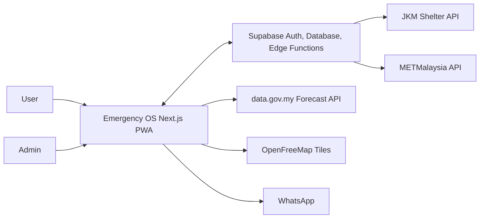
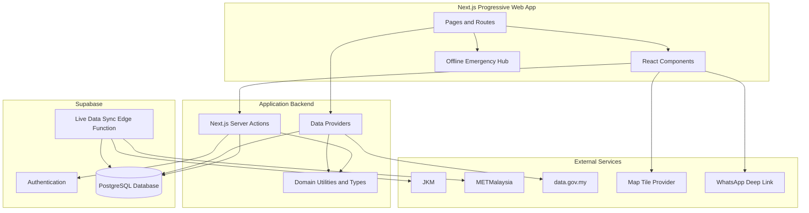
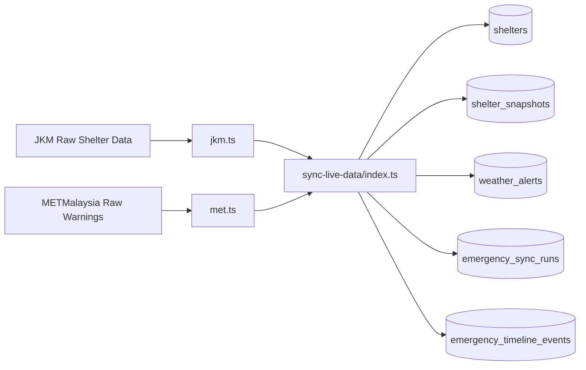
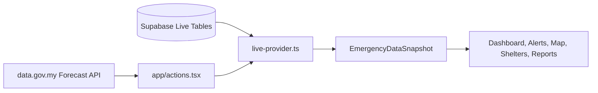
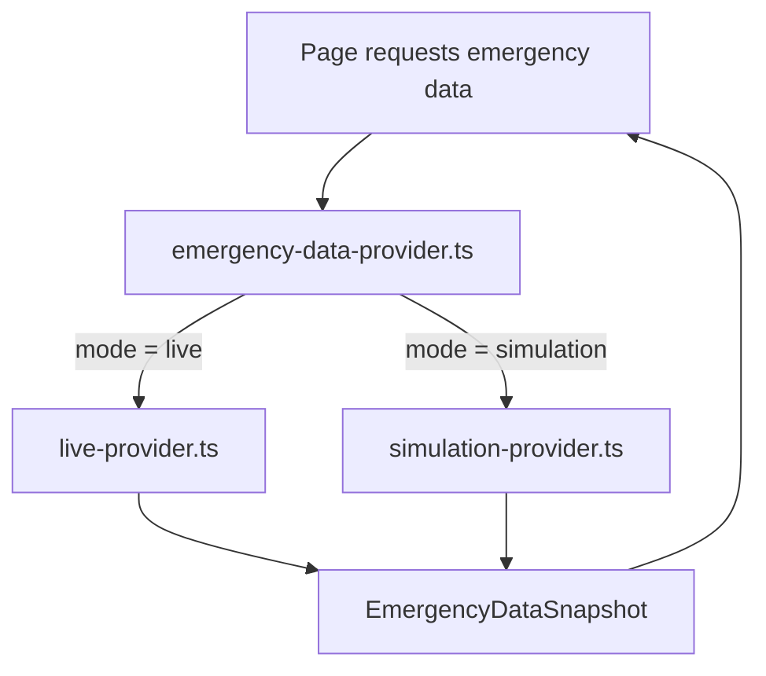
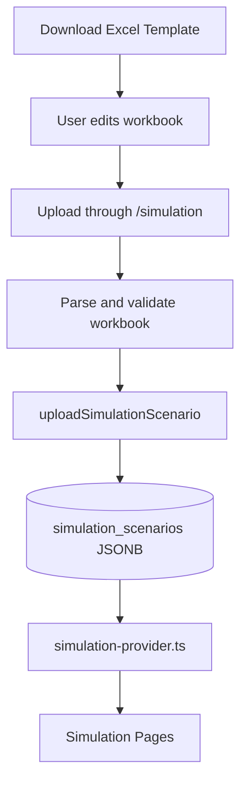
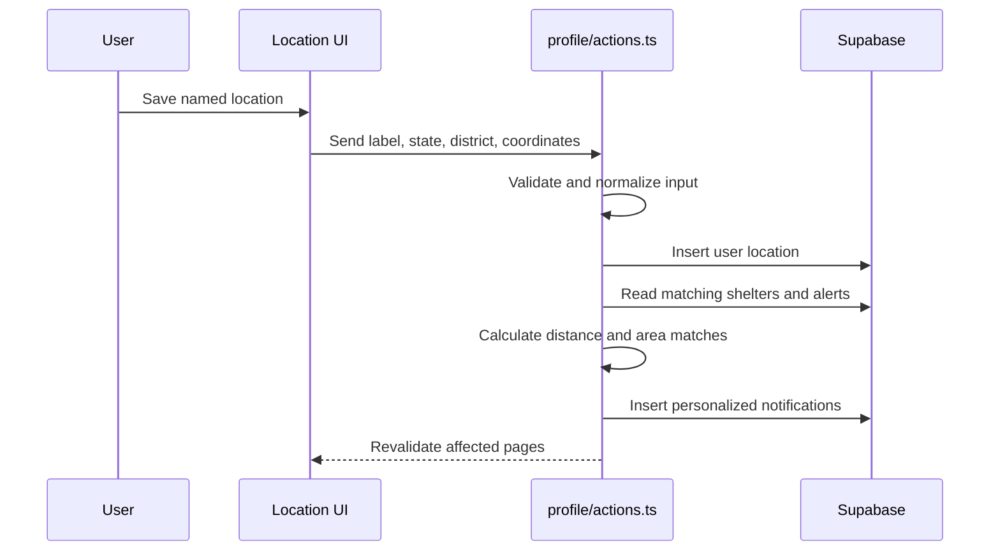
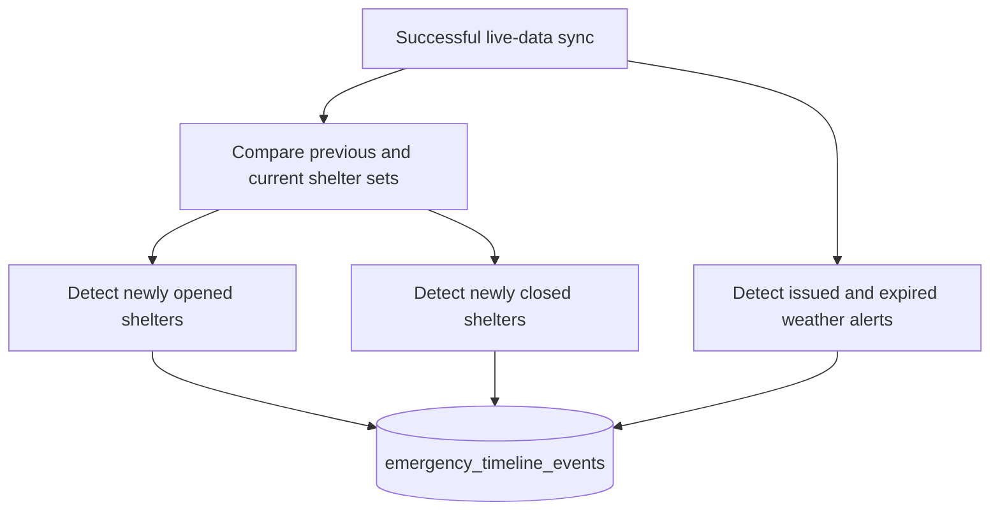
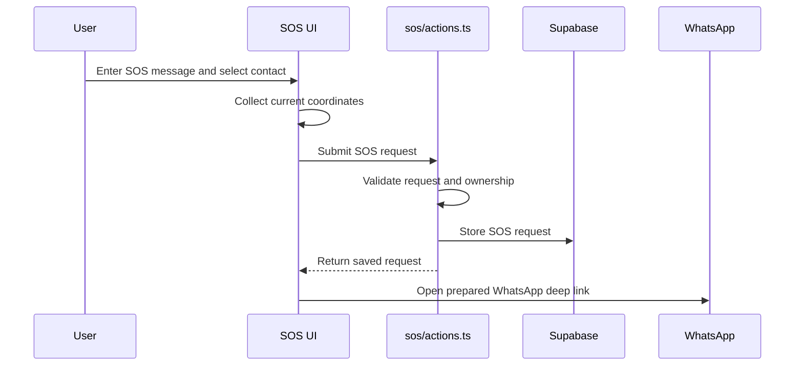
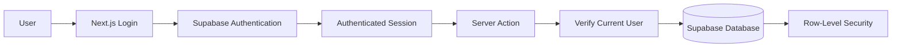

# Emergency OS System Architecture and Data Flow Guide

Date: 2026-06-10

## Purpose

This document explains how Emergency OS works as a complete system:

```txt
where data originates
how data is normalized and stored
how pages receive data
how live and simulation modes differ
how user-specific operations work
how timeline and offline data work
which files control each responsibility
```

It is intended as a study and presentation reference. The Mermaid diagrams can
also be copied into Mermaid-compatible diagram tools.

## Core Architectural Idea

The primary live emergency data flow is:

```txt
External emergency APIs
        |
        v
Supabase Edge Function ingestion and normalization
        |
        v
Supabase PostgreSQL database
        |
        v
Application data providers
        |
        v
Next.js pages and React components
```

User-requested operations, such as saving a location or submitting an SOS
request, follow a separate path:

```txt
Page or component
        |
        v
Next.js Server Action
        |
        v
Validation and domain logic
        |
        v
Supabase database
```

## Main Responsibilities

| Directory | Responsibility |
|---|---|
| `app/` | Next.js routes, pages, and Server Actions |
| `components/` | Reusable user-interface components |
| `data/providers/` | Builds application-ready live or simulation snapshots |
| `data/mock/` | Built-in fallback simulation scenarios |
| `supabase/functions/` | Fetches and normalizes external live data |
| `supabase/migrations/` | Defines and evolves the database schema |
| `lib/` and `utils/` | Shared domain calculations and utilities |
| `types/` | Shared TypeScript domain contracts |
| `public/` | PWA assets, generated service worker, icons, and map data |

## System Context Diagram



Important current implementation detail:

```txt
JKM shelter and METMalaysia warning ingestion primarily occurs in the
Supabase Edge Function.

Weather forecasts are still fetched directly through app/actions.tsx.

Some direct JKM-fetching logic also remains in app/actions.tsx.
```

## Container Architecture



## Live Emergency Data Flow

### Ingestion

The live-data ingestion process runs independently from page rendering.



The Edge Function:

1. Fetches raw external data.
2. Converts inconsistent external fields into the database schema.
3. Upserts stable shelter identities.
4. Stores shelter snapshots for each successful synchronization.
5. Stores weather alerts using deterministic identifiers.
6. Detects shelter opening and closing transitions.
7. Creates emergency timeline events.
8. Records whether each synchronization succeeded or failed.

### Reading Live Data



`live-provider.ts` reads normalized database records and converts them into the
frontend domain model. It combines public emergency data and authenticated
user-owned data into one `EmergencyDataSnapshot`.

Pages therefore do not need to query every database table separately.

## Normalization Boundaries

There are two important data transformations.

### External API Normalization

Performed by the Edge Function:

```txt
external API response -> stable database schema
```

Example:

```txt
JKM id_pusat       -> shelters.id
JKM nama_pusat     -> shelters.name
JKM jumlah_mangsa  -> shelter_snapshots.victims
```

### Provider Mapping

Performed by application providers:

```txt
database rows -> frontend domain model
```

Example:

```txt
shelter_snapshots.victims -> PPS.mangsa
shelters.state             -> PPS.negeri
```

The database acts as the contract between Edge Function ingestion and the
Next.js application.

## Live and Simulation Provider Selection

Pages use a shared provider entry point:

```ts
const data = await getEmergencyData({ mode });
```



Both providers return the same domain contract. This allows pages to render
either mode without knowing the original data source.

## Simulation Data Flow



The workbook supports:

```txt
Shelters
WeatherAlerts
Forecasts
TimelineEvents
```

The active uploaded scenario controls the simulation environment. If no active
scenario is available, the provider falls back to the built-in mock scenario.

Live and simulation user records are intentionally separated:

```txt
user_locations              -> live mode
simulation_user_locations   -> simulation mode
notifications               -> live mode
simulation_notifications    -> simulation mode
```

This prevents testing activity from affecting real user data.

## Saved Location and Personalized Notification Flow



Examples of named locations:

```txt
Family Home
Mama's Home
Office
University
```

Notification matching currently occurs when a location is saved and when a
simulation scenario is activated. The notification logic checks:

```txt
shelters within the configured distance
shelters in the same district and state
weather alerts mentioning the district or state
```

## Emergency Timeline Flow

The system deliberately separates current state from historical transitions.

```txt
EmergencyDataSnapshot:
"What is happening now?"

EmergencyTimelineSnapshot:
"What changed, and when?"
```

### Timeline Event Generation



Supported event types:

```txt
shelter_opened
shelter_closed
shelter_capacity_changed
weather_alert_issued
weather_alert_expired
```

A failed JKM request does not produce shelter closure events because a failed
request is not evidence that every shelter closed.

### Timeline Display

```mermaid
flowchart LR
    Route[/timeline] --> Selector[timeline-provider.ts]
    Selector -->|live| Live[live-timeline-provider.ts]
    Selector -->|simulation| Sim[simulation-timeline-provider.ts]
    Live --> Snapshot[EmergencyTimelineSnapshot]
    Sim --> Snapshot
    Snapshot --> Graph[Active Shelter Graph]
    Snapshot --> List[Chronological Event List]
```

## SOS and Emergency Contact Flow



Current limitation:

```txt
The backend records the SOS request, but WhatsApp delivery depends on the user
opening and sending the generated message. The system does not currently
receive delivery confirmation from a messaging provider.
```

## PWA and Offline Data Flow

```mermaid
flowchart TD
    Online[Online Emergency Data] --> Sanitize[Remove private user data]
    Sanitize --> IndexedDB[(IndexedDB Public Snapshot)]
    Online --> ServiceWorker[Service Worker Asset Cache]
    NetworkFail[Network unavailable] --> OfflineRoute[/offline]
    IndexedDB --> OfflineRoute
    ServiceWorker --> OfflineRoute
```

The offline snapshot deliberately excludes:

```txt
saved locations
personal notifications
SOS history
emergency contacts
user identifiers
exact user coordinates
```

The service worker handles installation and static asset caching. IndexedDB
stores the sanitized public emergency snapshot.

Offline map tiles are intentionally omitted, so the map provider still
requires a network connection.

## Authentication and Security Flow



Private records protected by user ownership include:

```txt
saved locations
alert preferences
notifications
SOS requests
emergency contacts
simulation scenarios
simulation locations
simulation notifications
```

Public emergency records, such as shelters and public timeline events, can be
read without exposing private user data.

## How the Main Layers Connect

### Edge Functions and Providers

`supabase/functions/` and `data/providers/` do not directly call each other.
They connect through the database:

```txt
External API
    |
    v
Supabase Edge Function
    |
    | writes normalized records
    v
Supabase Database
    |
    | reads records
    v
Application Provider
    |
    v
Page
```

### Providers and Pages

Providers assemble complete application-ready snapshots. Pages should request
those snapshots rather than independently reconstructing emergency data.

### Components and Server Actions

Client components use Server Actions for user-triggered writes. Server Actions
authenticate the user, validate inputs, execute database operations, and
revalidate affected routes.

## Important Files to Study

Study these files in this order:

1. `types/emergency.ts`
   - Defines the main emergency domain contracts.

2. `data/providers/emergency-data-provider.ts`
   - Selects live or simulation mode.

3. `data/providers/live-provider.ts`
   - Builds the live `EmergencyDataSnapshot`.

4. `data/providers/simulation-provider.ts`
   - Builds the simulation `EmergencyDataSnapshot`.

5. `supabase/functions/sync-live-data/index.ts`
   - Coordinates live-data ingestion.

6. `supabase/functions/sync-live-data/jkm.ts`
   - Fetches and normalizes JKM shelter data.

7. `supabase/functions/sync-live-data/met.ts`
   - Fetches and normalizes METMalaysia warnings.

8. `app/profile/actions.ts`
   - Handles live saved locations and personalized notifications.

9. `app/profile/sim-actions.ts`
   - Handles simulation scenarios, locations, and notifications.

10. `app/sos/actions.ts`
    - Handles SOS records and emergency contacts.

11. `data/providers/live-timeline-provider.ts`
    - Reads historical live emergency events.

12. `next.config.ts`
    - Defines PWA installation and service-worker caching behavior.

## Current Architectural Strengths

```txt
shared live and simulation provider contract
server-side private database operations
Supabase Row-Level Security
separate ingestion and presentation responsibilities
historical timeline separated from current-state data
additive database migrations
simulation isolation
sanitized offline public data
typed domain models
```

## Current Architectural Limitations

### Service Boundaries Are Not Fully Explicit

The architecture diagram identifies separate weather, shelter, SOS,
notification, and location services. Those responsibilities exist, but some
are combined inside large Server Action files.

For example, `app/profile/actions.ts` currently handles:

```txt
location validation
location persistence
shelter proximity matching
weather alert matching
notification generation
```

### Some Dependency Directions Are Reversed

Reusable provider modules currently import actions and types from `app/`:

```txt
data/providers/live-provider.ts -> app/actions.tsx
data/providers/simulation-provider.ts -> app/profile/sim-actions.ts
```

The cleaner long-term direction is:

```txt
app routes and actions -> reusable services and providers
```

### External Data Fetching Has Two Paths

Most persisted live shelter and weather warning ingestion occurs in the Edge
Function. However, `app/actions.tsx` still directly fetches:

```txt
weather forecasts
some JKM shelter data
```

This creates duplicated external integration responsibilities.

### Notifications and SOS Delivery Are Limited

Notification records are generated in the database, but there is no dedicated
external push, SMS, or email delivery service.

SOS records are stored, while WhatsApp delivery remains a user-completed deep
link workflow.

## Presentation Summary

The shortest accurate explanation of the system is:

```txt
Supabase Edge Functions ingest and normalize public live emergency data.

Supabase stores public emergency data, historical events, authentication, and
private user-owned records.

Application providers read and combine that data into consistent snapshots for
Next.js pages.

Server Actions handle authenticated user operations such as saved locations,
scenario management, notifications, contacts, and SOS requests.

The provider abstraction allows the same pages to operate with either live or
simulation data.

The PWA service worker and IndexedDB provide an offline-safe public emergency
view without caching private user data.
```

## Recommended Presentation Diagrams

Use these diagrams separately rather than placing everything into one crowded
diagram:

1. System Context Diagram
2. Container Architecture Diagram
3. Live Data Ingestion and Reading Diagram
4. Live Versus Simulation Provider Diagram
5. Saved Location and Personalized Alert Sequence Diagram
6. Emergency Timeline Data Flow Diagram
7. SOS Sequence Diagram
8. Offline PWA Data Flow Diagram
9. Authentication and Row-Level Security Diagram

The most important distinction to communicate is:

```txt
Edge Functions ingest and store live data.
Providers assemble data for pages.
Server Actions perform authenticated user-requested operations.
Pages and components display the results.
Supabase connects the persistent parts of the system.
```
